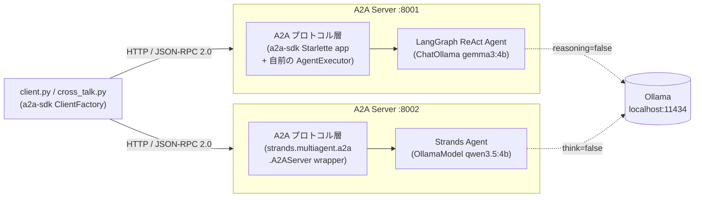
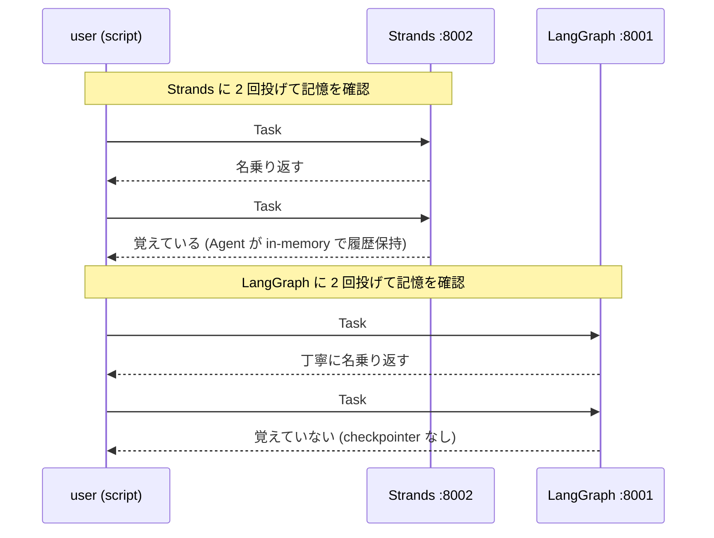
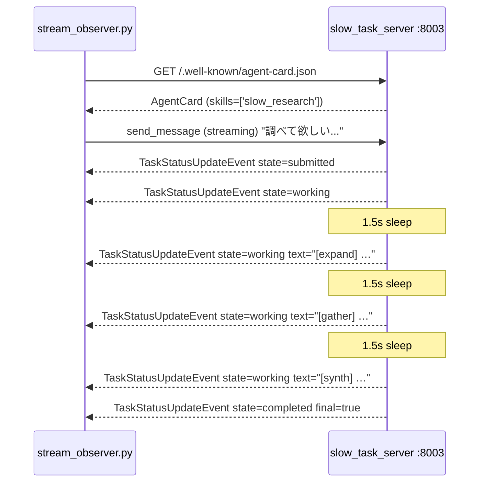
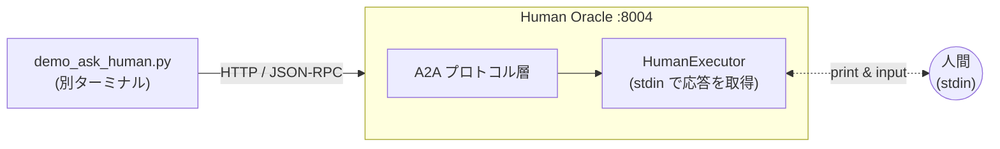
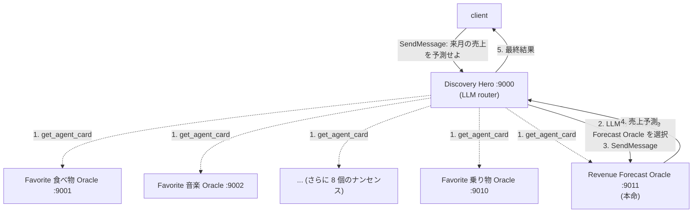

```mermaid
flowchart LR
    Client["mesh_demo.py<br/>(top-level client)"]
    subgraph A["Agent A (Coordinator) :8005"]
        direction TB
        AA["A2A Server"]
        ALLM["LangChain + gemma3:4b<br/>「1 桁の足し算を出題」"]
        AClient["A2A Client → Agent B"]
        AA --> ALLM --> AClient
    end
    subgraph B["Agent B (Delegator) :8006"]
        direction TB
        BA["A2A Server"]
        BLLM["LangChain + qwen3.5:4b<br/>「人間への依頼文に清書」"]
        BClient["A2A Client → Human"]
        BA --> BLLM --> BClient
    end
    subgraph H["Human Oracle :8004"]
        direction TB
        HA["A2A Server"]
        HE["HumanExecutor<br/>(stdin で受付)"]
        HA --> HE
    end
    Human(("人間"))
    Client -->|SendMessage| A
    AClient -->|SendMessage| B
    BClient -->|SendMessage| H
    HE -.->|print & input| Human
```

# study-a2a-ollama

A2A プロトコルを手で触って理解するための最小構成サンプル集。Ollama をバックエンドとして、以下 3 つの異なる観点で A2A の挙動を観察する:

1. **greeting**: LangGraph と Strands という異なるフレームワークで作ったエージェントが同じ A2A クライアントから透過的に呼べることを確認（cross-talk も含む）
2. **task_lifecycle**: 長時間タスクの `submitted → working → completed` 状態遷移を SSE ストリーミングで観察
3. **human_oracle**: 人間を「独立した Agent Card を持つノード」として A2A メッシュに参加させる実験（`INPUT_REQUIRED` を使わず、人間そのものを 1 エージェントとして扱う）

## ディレクトリ構成

```
study-a2a-ollama/
├── src/
│   ├── greeting/                   # 1. 基本の挨拶デモ + cross-talk
│   │   ├── langgraph_server.py     #    :8001 LangGraph + gemma3:4b（丁寧語）
│   │   ├── strands_server.py       #    :8002 Strands + qwen3.5:4b（タメ口）
│   │   ├── client.py               #    両サーバーに挨拶を投げる
│   │   └── cross_talk.py           #    Strands ↔ LangGraph のバケツリレー
│   ├── task_lifecycle/             # 2. Task 状態遷移の観察
│   │   ├── slow_task_server.py     #    :8003 疑似 3 ステップ調査（LLM 不使用）
│   │   └── stream_observer.py      #    SSE で全イベントを時系列ログ
│   ├── human_oracle/                # 3. 人間を A2A ノードとして扱う実験
│   │   ├── human_server.py         #    :8004 stdin で応答する「Human Oracle」
│   │   ├── demo_ask_human.py       #    別ターミナルから Human Oracle を叩くクライアント
│   │   └── single_terminal_demo.py #    サーバー + クライアントを同一プロセスで起動
│   ├── agent_mesh/                 # 4. Agent A → Agent B → Human の多段委譲
│   │   ├── coordinator.py          #    :8005 gemma3:4b で 1 桁の足し算を出題
│   │   ├── delegator.py            #    :8006 qwen3.5:4b で人間向け依頼文に清書し Human へ
│   │   └── mesh_demo.py            #    3 サーバー + クライアントを同一プロセスで起動
│   └── agent_discover/             # 5. Agent Card カタログから LLM が相手を選ぶ
│       ├── nonsense_server.py      #    おとり用の「好きな○○を返す」だけのエージェント工場
│       ├── revenue_oracle_server.py #   :9011 唯一の本命「Redash 売上予測」エージェント
│       ├── hero_server.py          #    :9000 タスクから最適相手を選んで委譲するルーター
│       └── discover_demo.py        #    10 ナンセンス + 1 本命 + 1 ヒーロー を同一プロセスで起動
├── scripts/
│   ├── hello.sh                    # greeting デモを一発実行
│   ├── cross_talk.sh               # greeting のバケツリレーを一発実行
│   ├── task.sh                     # task_lifecycle デモを一発実行
│   ├── human.sh                    # human_oracle 単体デモを一発実行
│   ├── mesh.sh                     # agent_mesh マルチホップデモを一発実行
│   └── discover.sh                 # agent_discover 発見 & 委譲デモを一発実行
├── pyproject.toml
├── uv.lock
└── README.md
```

## 前提

- Ollama が起動済み（`ollama serve` 済み）
- モデル pull 済み: `ollama pull gemma3:4b qwen3.5:4b`
- Python 3.11+ と `uv`

## セットアップ

```bash
cd study-a2a-ollama
uv sync
```

### （個人用）gitleaks pre-commit hook の有効化

このリポは個人学習用で、ローカルに置いた `.gitleaks.toml`（`.gitignore` 済み）で
機密ワードをコミット前に弾く運用をしている。新しいマシンで clone した直後に 1 度だけ:

```bash
brew install gitleaks                    # 未導入なら
git config core.hooksPath .githooks      # .githooks/pre-commit を有効化
cp /path/to/your/.gitleaks.toml ./       # 個人ルールを配置（push されない）
```

hook は 2 つのガードを兼ねる:

1. `.gitleaks.toml` が無いと commit を拒否（別マシンで設置忘れ防止）
2. `.gitleaks.toml` が有れば `gitleaks protect --staged` で staged diff をスキャン

---

## 1. greeting: 異なるフレームワークが同じ A2A で喋る

### 構成



外部に公開される「A2A サーバー」としてのインターフェースはどちらも同じ（Agent Card 配布 + `SendMessage` JSON-RPC）。箱の内側の LangGraph / Strands はあくまで各サーバーの内部実装で、A2A クライアントからは区別できない。これが A2A のフレームワーク非依存性。

### 実行

```bash
./scripts/hello.sh
```

両サーバーを起動し、モデルを事前ウォームアップし、Agent Card を取得し、挨拶を送信してレスポンスを表示する。

### 期待する出力

```
=== LangGraph (丁寧) @ http://127.0.0.1:8001 ===
[card] name      = LangGraph Formal Greeter
[card] skills    = ['greet_formally']
[card] streaming = True
[send] こんにちは。あなたは誰ですか？
[recv] この度は、ご質問いただき誠にありがとうございます。私は…でございます。

=== Strands (タメ口) @ http://127.0.0.1:8002 ===
[card] name      = Strands Casual Greeter
[card] skills    = []
[card] streaming = True
[send] こんにちは。あなたは誰ですか？
[recv] こんにちは！僕、あなたのフレンドリーなアシスタントだよ。
```

### クロスフレームワーク相互運用（cross-talk）

`./scripts/cross_talk.sh` で一発実行できる（サーバー起動・モデルウォームアップ・cross_talk.py 実行を全部やる）。

```bash
./scripts/cross_talk.sh
```

実際の中身は「**各エージェントは前のターンを覚えているか？**」の記憶テスト。自己紹介で独特の名前（西園寺昌之）を告げた後、新しい Task で「私の名前を覚えていますか？」と聞く。A2A プロトコル上は各 SendMessage が独立した Task なので、理屈の上では覚えていないはず。

観察される挙動:

- **LangGraph 版（自前 AgentExecutor + checkpointer なし）**: 覚えていない（期待通り）
- **Strands 版（`A2AServer(agent=...)` wrapper）**: 覚えている（Agent インスタンスが会話履歴を保持し、A2A 呼び出しをまたいで使い回されるため）

つまり A2A プロトコル自体は Task ごとステートレスでも、**フレームワーク実装が暗黙に stateful にしてしまう**ことがある。これは A2A のフレームワーク非依存性と裏腹で、サーバー実装の挙動を把握しておかないと混乱する落とし穴。



同じ `a2a-sdk` クライアントがフレームワークの違いを意識せず両方を呼べるという事実と、**サーバー実装が暗黙にステートフルになりうる**という落とし穴の両方が、このデモで体験できる。

---

## 2. task_lifecycle: Task 状態遷移を観察する

### 構成



`slow_task_server.py` は LLM を呼ばず、`TaskUpdater.update_status()` を使ってタイマー経由で状態を進める教育用実装。

### 実行

```bash
./scripts/task.sh
```

### 期待する出力

```
14:23:56.692 [card] Slow Research Demo
14:23:56.692 [send] Rust の所有権モデルを要約して
14:23:56.696 [evt ] TaskStatusUpdateEvent state=submitted final=False text=''
14:23:56.696 [evt ] TaskStatusUpdateEvent state=working   final=False text=''
14:23:58.197 [evt ] TaskStatusUpdateEvent state=working   final=False text='[expand] クエリを 3 個のサブクエリに展開しています'
14:23:59.699 [evt ] TaskStatusUpdateEvent state=working   final=False text='[gather] 関連情報を収集しています'
14:24:01.201 [evt ] TaskStatusUpdateEvent state=working   final=False text='[synth] サマリを合成しています'
14:24:01.201 [evt ] TaskStatusUpdateEvent state=completed final=True  text='…完了しました。'
```

**学べること**: A2A の Task は HTTP/JSON-RPC の上に乗っているが、**SSE で中間状態をストリーミングできる**。長時間タスクで進捗を返す必要がある場合はこれを使う。

---

## 3. human_oracle: 人間を A2A ノードとして扱う実験

### モチベーション

A2A 仕様には `TASK_STATE_INPUT_REQUIRED`（タスクが人間の入力を待つ割込状態）がある。通常の「human-in-the-loop」はこれで十分。

しかし本当に突き詰めると、**人間そのものに独立した Agent Card を持たせて A2A メッシュに 1 ノードとして参加させる**設計もできるはず。これを確認するのがこのデモ。

### 構成



`human_server.py` は LLM を一切呼ばない。Agent Card から見れば「スキル `ask_human` を持つ、応答に数秒〜数時間かかるエージェント」として透過的に振る舞う。

### 実行（1 ターミナル版 / 推奨）

```bash
./scripts/human.sh
```

サーバーとクライアントを同一プロセスの asyncio で起動する。このターミナルに質問が表示されるので、**そのまま**人間として 1 行で応答を入力して Enter。別ターミナルは不要。

### 実行（2 ターミナル版）

サーバーとクライアントを別プロセスで観察したい場合:

ターミナル A:

```bash
uv run python src/human_oracle/human_server.py
```

ターミナル B:

```bash
uv run python src/human_oracle/demo_ask_human.py
```

ターミナル A に質問が表示されるので、人間として応答を入力。

### 期待する出力

```
14:13:24 [card] Human Oracle: 人間を 1 ノードとして A2A メッシュに公開する実験的エージェント。
14:13:24 [card] skills: ['ask_human']

14:13:24 [send] チャレンジ: A2A プロトコルを一言で表現するとしたら何と言いますか？

14:13:24 [evt ] state=submitted text=None
14:13:24 [evt ] state=working   text=None
14:13:27 [evt ] state=completed text='…（人間が入力した応答）…'

14:13:27 [done] human's answer: …（人間が入力した応答）…
```

### 学べた結論

**成立する**。`INPUT_REQUIRED` で止めずに、人間ノードに普通に Task を投げて `completed` まで進められる。AI と人間がメッシュ上で対等な「エージェント」になる設計が A2A の枠内でそのまま表現できる。

これは将来「専門家プール」「承認者プール」などを A2A サービスとして提供するモデルの原型になりうる。

---

---

## 4. agent_mesh: マルチホップ委譲 (Agent A → Agent B → Human)

### モチベーション

A2A の真骨頂は **3 つ以上のエージェントが鎖状に委譲する**こと。各エージェントは上流から見ればサーバー、下流から見ればクライアント。全員が Agent Card を持ち、互いの内部実装を知らないまま連携する。

### 構成



### 処理フロー

1. `mesh_demo.py` が「計算して」と Agent A に投げる
2. Agent A が gemma3:4b で `5 + 3 = ?` のような問題を生成
3. Agent A が Agent B に A2A で委託
4. Agent B が qwen3.5:4b で `5 + 3 を計算して答えを教えていただけますか` に清書
5. Agent B が Human Oracle に A2A で委託
6. Human Oracle が stdin でプロンプトを出し、人間が `8` と入力
7. 答えが逆方向に伝播: Human → Agent B → Agent A → トップレベルクライアント

### 実行

```bash
./scripts/mesh.sh
```

### 期待する出力

```
[warmup] pulling models into memory
14:51:14 [boot] starting Human Oracle ...
14:51:14 [boot] starting Agent B (Delegator) ...
14:51:14 [boot] starting Agent A (Coordinator) ...
14:51:14 [boot] all servers ready

14:51:14 [client] Agent A: Calculation Coordinator / skills=['generate_and_solve']
14:51:14 [client] 「計算して」と依頼します

14:51:14 [evt A] state=submitted text=None
14:51:14 [evt A] state=working text=None
14:51:15 [evt A] state=working text='[Agent A] gemma3:4b が出題: 5 + 3 = ?'
14:51:15 [evt A] state=working text='[Agent A] Agent B に委託'

============================================================
[human oracle] incoming task_id=…
------------------------------------------------------------
5 + 3 を計算して答えを教えていただけますか
------------------------------------------------------------
応答を 1 行で入力して Enter. (Ctrl+C で reject)
answer: 8
============================================================

14:51:17 [evt A] state=working text='[Agent A] Agent B から回答を受領: 8'
14:51:17 [evt A] state=completed text='5 + 3 = ? → 8'

14:51:17 [client] 最終結果: 5 + 3 = ? → 8
```

### 学べた結論

- **各エージェントは隣の相手しか知らない**。Agent A は Human Oracle の存在を知らない。Agent B は上流が script なのか別の AI なのかを知らない。
- **LLM の役割も分業**できる。問題生成に向いたモデル（gemma）と言い回しが得意なモデル（qwen）を一つの流れの中で使い分けられる。
- **トップレベル Client から見えるのは Agent A のイベントだけ**。opacity が効いている。内部で Human が叩かれても Agent A の Task が `completed` になれば仕事は完了。
- 途中に Human が挟まっても、`INPUT_REQUIRED` で止めず「そういう Agent Card を持つノード」として透過的に扱える。

---

---

## 5. agent_discover: LLM が Agent Card カタログから相手を選ぶ

### モチベーション

A2A の本命シナリオは「**ある問いに対して、適切な相手を LLM が自律的に発見して呼ぶ**」こと。これまでのデモはプログラマが呼び先をハードコードしていたが、このデモは **LLM 自身が Agent Card の description / skills を読んで選ぶ**。

### 構成



### 処理フロー

1. `scripts/discover.sh` が 12 サーバー（10 ナンセンス + 1 本命 + 1 ヒーロー）を同一プロセスで起動
2. トップレベル client が Hero に「来月の売上を予測せよ」を投げる
3. Hero が既知 URL 11 個から Agent Card を取得（Direct Configuration discovery）
4. Hero の LLM（gemma3:4b）にタスク + 11 個の name/description/skills を渡して **name を 1 行だけ返すよう指示**
5. LLM が `Revenue Forecast Oracle` を選ぶ
6. Hero が A2A クライアントで Revenue Oracle を呼び、ダミーの売上予測を受け取る
7. トップレベル client に結果を返す

### 実行

```bash
./scripts/discover.sh
```

### 期待する出力

```
15:38:48 [boot] nonsense '食べ物' :9001
15:38:48 [boot] nonsense '音楽' :9002
...（10 個分）
15:38:48 [boot] Revenue Forecast Oracle :9011
15:38:48 [boot] Discovery Hero :9000
15:38:48 [boot] all 12 servers ready

15:38:48 [client] タスク送信: 来月の売上を予測せよ

15:38:48 [hero ] state=working text='[Hero] 11 個のエージェントを発見'
15:38:48 [hero ] state=working text='[Hero] LLM にタスクと Agent Card 一覧を渡して最適な相手を選ばせる...'
15:38:49 [hero ] state=working text='[Hero] 選択: Revenue Forecast Oracle @ http://127.0.0.1:9011'
15:38:50 [hero ] state=completed text='選択されたエージェント: Revenue Forecast Oracle\n\n回答:\n来月の売上予測: ¥185,000,000（前月比 +8.5%）\n根拠: 過去 3 ヶ月の売上傾向と、季節的な要因（夏季の増加傾向）を考慮した見込み'
```

### 学べた結論

- **Agent Card カタログは LLM にとって読める**。name / description / skills を構造化テキストで渡せば gemma3:4b 程度でも正しい相手を選べる。
- **discover の本質は「意味的マッチング」**。DNS は文字列一致で済むが、A2A は「この skill 説明はタスクに合うか？」という自然言語理解が入る。だから LLM ルーターが要る。
- Agent Card の `description` と `skills[*].description` が**商品カタログのコピーライティング**として重要になる。カード表現が曖昧だと LLM が迷う。
- 実運用で自分のエージェントが選ばれるか否かは、**Agent Card の書き方**でほぼ決まる。エンジニアというよりテクニカルライター寄りの仕事になる。

---

## What is A2A?

A2A（Agent2Agent Protocol）は、**エージェント同士が組織境界を越えて「名刺交換」してから対話できるようにするプロトコル**。Google が提唱し、現在は Linux Foundation の OSS プロジェクト。

公式仕様書でも Agent Card を **"digital business card"** と呼んでおり、「名刺交換」の比喩はそのまま当てはまる。

### 似たような技術との違い

| 技術 | アナロジー | 関係性 | 信頼境界 | いつ選ぶか |
| --- | --- | --- | --- | --- |
| **MCP** | 「ハンマーを使う」 | エージェント → ツール | 同一 | エージェントから決定的な関数（DB / API / 計算）を呼びたい |
| **Claude Code Sub-agent** | 「社内で部下に移譲」 | 親 → 子（spawn・所有） | 同一セッション・同一コンテキスト | Claude Code 上で軽量な補助タスクを切り出したい |
| **LangGraph (subgraph / multi-agent)** | 「同じ会社のチームで分業」 | コード内で合成 | 同一プロセス・同一コードベース | 1 チームで完結する多段推論・ワークフロー |
| **A2A** | **「別の会社のコンサルタントと協業」** | ピア（対等） | **境界を越える**。相手の内部は見えない | 組織／ベンダー／フレームワークの境界を越えたエージェント協調 |

### 「A2A が正解」になる条件

少なくとも次のどれか 1 つを満たすとき:

1. **信頼境界を越える**: 相手のコードを見られない・共有できない
2. **長時間ステートフル**: Task ライフサイクル（`submitted` / `working` / `input-required` / `completed` など）を跨いだやりとり
3. **複数ベンダー・複数フレームワーク**: LangGraph / Strands / ADK / Claude Agent SDK / Bedrock AgentCore 等が混在する

逆に「社内の 1 チーム・1 コードベースで完結する」なら **LangGraph のサブグラフ**のほうが取り回しが良い。「決定的な関数を呼ぶだけ」なら **MCP** で十分。

### プロダクト例

A2A じゃないと成立しない世界として、以下のような「他社エージェント同士の連携」がある:

- Salesforce **Agentforce** × SAP **Joule** × ServiceNow **Now Assist AI Agents**
- Microsoft **Copilot Studio** × Google **ADK** 製エージェント
- 業界を問わず、自社エージェントが他社の専門エージェントを呼ぶパターン（例: 旅行アシスタントが航空会社と宿泊サービスのエージェントに A2A で発注する）

---

## 実装で踏んだ落とし穴（将来の自分へ）

### 1. qwen3 / qwen3.5 系は reasoning モデル

デフォルトで `<think>…</think>` を内部生成するため、`max_tokens` を 256 等に絞ると **MaxTokensReachedException** で落ちる。必ず reasoning を無効化する。

### 2. LangChain ChatOllama の reasoning 無効化は `reasoning=False`

```python
ChatOllama(model="gemma3:4b", reasoning=False, num_predict=256)
```

docstring に `think` の記述もあるが、**実際のフィールド名は `reasoning`**（`langchain_ollama/chat_models.py` 528 行目）。

### 3. Strands OllamaModel の無効化は `additional_args={"think": False}`

```python
OllamaModel(
    host="http://localhost:11434",
    model_id="qwen3.5:4b",
    max_tokens=256,
    additional_args={"think": False},  # Ollama API の top-level `think` に流れる
)
```

Strands の `OllamaConfig` には `think` フィールドが無い。`additional_args` が request dict にスプレッドされる実装（`strands/models/ollama.py` 221 行目）なので、Ollama API の仕様に従い `{"think": False}` を渡す。

### 4. モデルウォームアップは `num_predict: 1` で十分

```bash
curl -s http://localhost:11434/api/generate \
  -d '{"model":"gemma3:4b","prompt":"hi","stream":false,"options":{"num_predict":1}}'
```

返事本文は不要。モデルを VRAM に載せるのが目的。

### 5. client のタイムアウトは 180s 推奨

小型モデルでもコールドスタート時は 60s だと足りないことがある。

### 6. `A2AClient` は deprecated、`ClientFactory.connect()` を使う

```python
from a2a.client import ClientConfig, ClientFactory
config = ClientConfig(httpx_client=httpx_client, streaming=True)
client = await ClientFactory.connect(agent=base_url, client_config=config)
async for item in client.send_message(message):
    ...  # item は Message か (Task, TaskStatusUpdateEvent | TaskArtifactUpdateEvent | None)
```

旧 `A2AClient(...).send_message(SendMessageRequest(...))` は non-streaming で 1 発の応答だったが、新 API は streaming iterator を返す。イベント単位で処理するので SSE 観察がそのまま書ける。

---

## 次のステップ

- [x] Strands 側から A2A クライアントで LangGraph エージェントに問い合わせる（→ `src/greeting/cross_talk.py`）
- [x] ストリーミング（SSE）で `TaskStatusUpdateEvent` を受信する（→ `src/task_lifecycle/stream_observer.py`）
- [x] `A2AClient` → `ClientFactory` への移行（全クライアント対応済み）
- [x] 人間を A2A ノードとして扱う実験（→ `src/human_oracle/`）
- [x] マルチホップ委譲: Agent A → Agent B → Human（→ `src/agent_mesh/`）
- [x] LLM が Agent Card カタログから自律的に相手を選ぶ（→ `src/agent_discover/`）
- [ ] Strands 側の `enable_a2a_compliant_streaming=True` 対応
- [ ] **エージェント自身が A2A クライアントを持つ**（LangGraph エージェントの tool として Human Oracle を A2A で呼び出す）
- [ ] ツール（MCP）を追加してエージェントに具体的な仕事をさせる
- [ ] Cloud Run にデプロイして公開する
